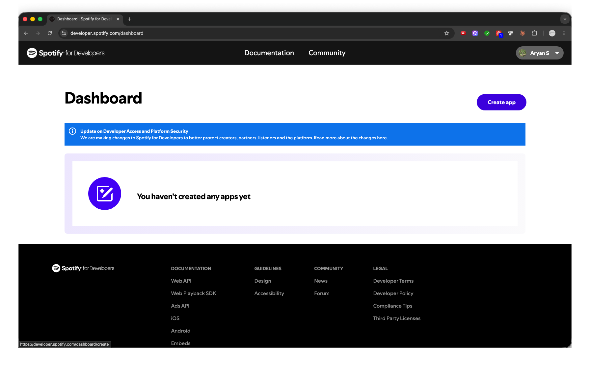
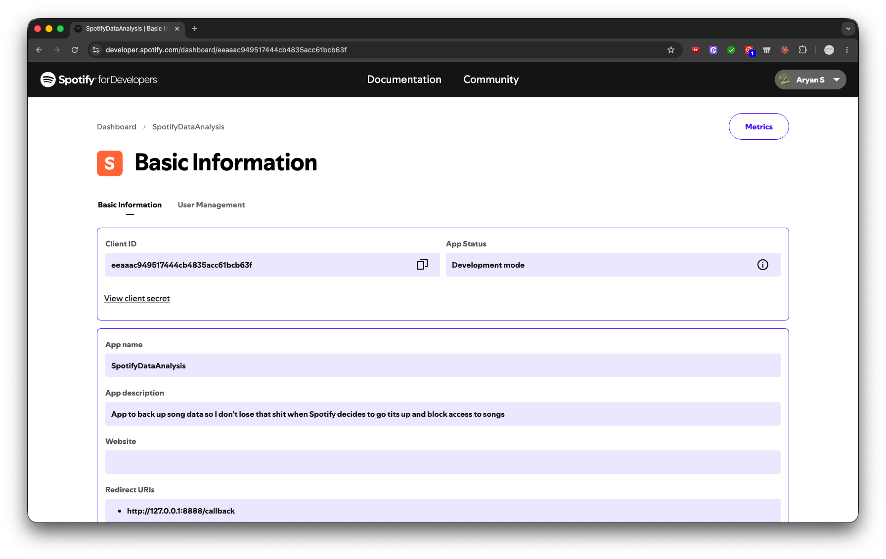
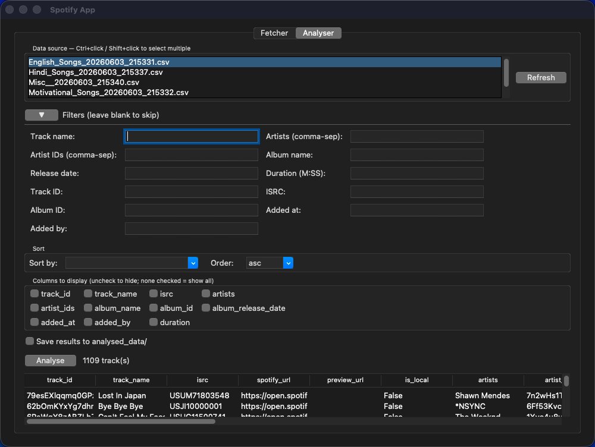
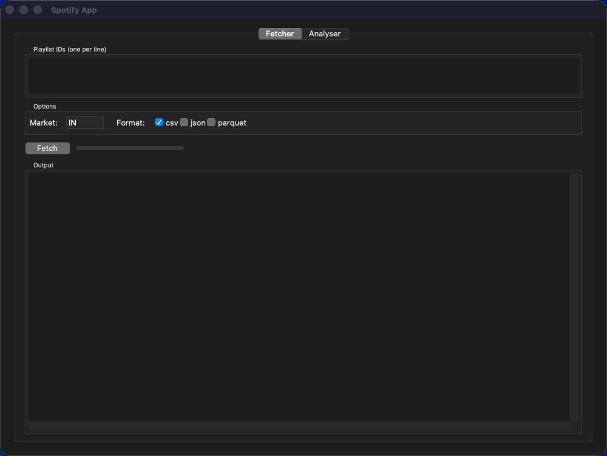
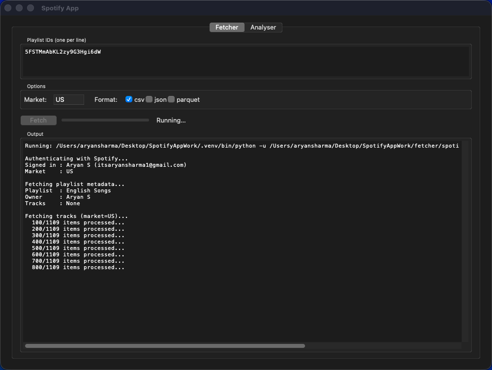
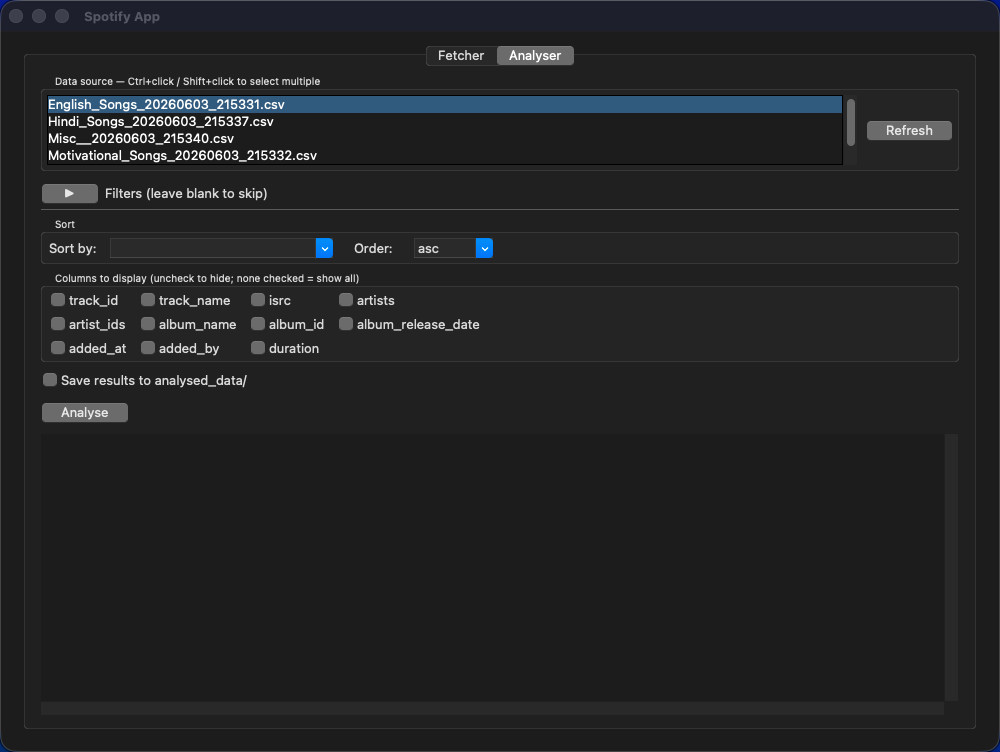
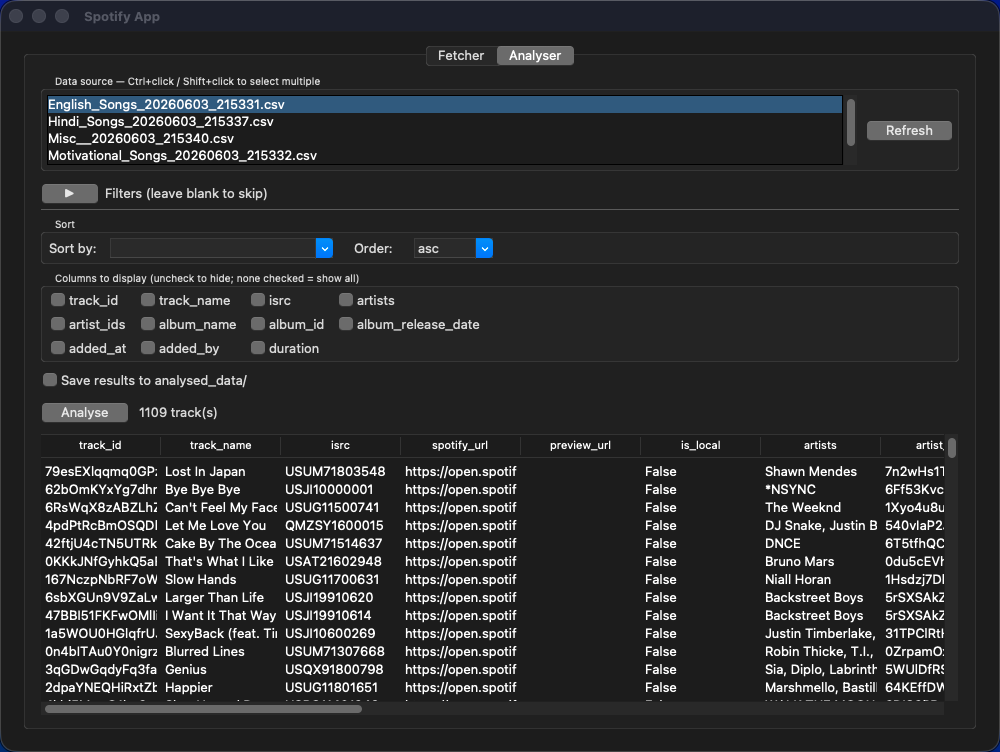
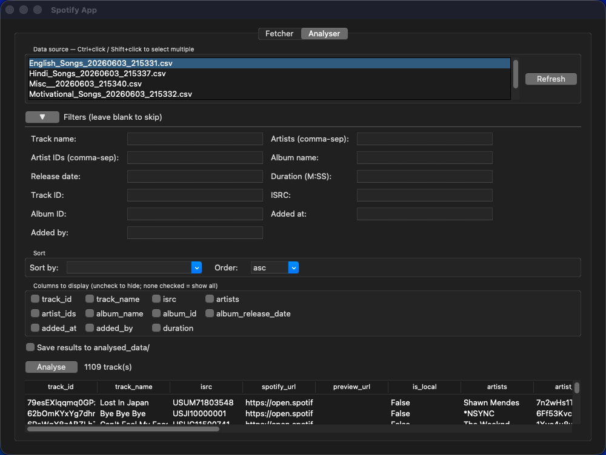
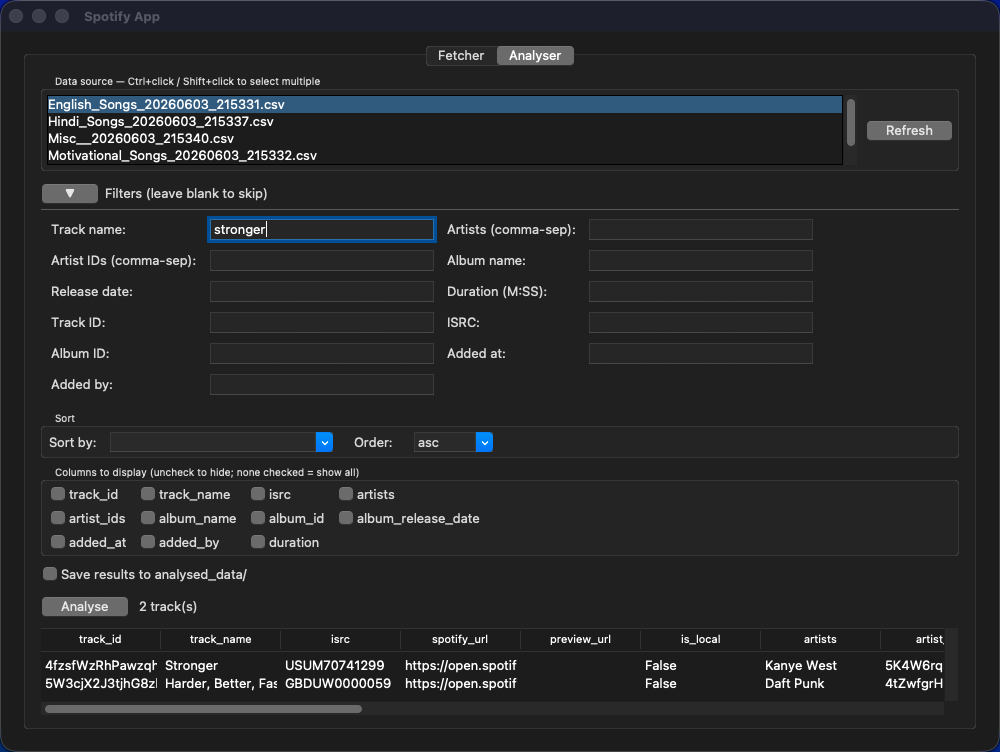

# Spotify Playlist Tool

A desktop GUI and CLI toolkit for pulling Spotify playlist data and exploring it with filters, sorting, and column selection. Fetch any playlist to CSV/JSON/Parquet, then analyse the results interactively — all without writing code.

---

## Contents

- [Features](#features)
- [Prerequisites](#prerequisites)
- [Installation](#installation)
- [Spotify API Setup](#spotify-api-setup)
- [Quick Start](#quick-start)
- [GUI Usage](#gui-usage)
  - [Fetcher Tab](#fetcher-tab)
  - [Analyser Tab](#analyser-tab)
- [CLI Reference](#cli-reference)
  - [Fetcher](#fetcher-cli)
  - [Analyser](#analyser-cli)
- [Output Files](#output-files)
- [Troubleshooting](#troubleshooting)
- [Running Tests](#running-tests)
- [Project Structure](#project-structure)

---

## Features

- **Fetch** any public Spotify playlist by ID, URI, or URL — supports multiple playlists in one run
- **Save** fetched data as CSV, JSON, and/or Parquet
- **Analyse** interactively in the GUI: live filters, sort, column selection — results update on every keystroke with no re-clicking
- **Filter** by track name, artist, album, release date, duration, ISRC, IDs, and more
- **Substring search** on text fields (type any part of the value); exact matching for IDs and codes
- **Sort** by any column: alphabetically, chronologically, or by duration
- **Auto-fit column widths** with a double-click (Excel-style)
- **Save results** to CSV from the GUI
- Full CLI interface for scripting and automation

---

## Prerequisites

| Requirement | Version | Notes |
|---|---|---|
| Python | 3.14.3 | Via [pyenv](https://github.com/pyenv/pyenv) — see below |
| [pyenv](https://github.com/pyenv/pyenv) | any | Manages the Python version |
| [Homebrew](https://brew.sh) | any | macOS only; needed for Tcl/Tk (GUI) |
| Spotify account | free or premium | For the developer API |

---

## Installation

### 1. Install pyenv (if not already installed)

```bash
brew install pyenv
```

Add the following to your `~/.zshrc` or `~/.bash_profile`:

```bash
export PYENV_ROOT="$HOME/.pyenv"
export PATH="$PYENV_ROOT/bin:$PATH"
eval "$(pyenv init -)"
```

Then reload your shell:

```bash
source ~/.zshrc
```

### 2. Install Tcl/Tk (required for the GUI)

Tcl/Tk **must be installed before Python is built by pyenv**, or the GUI module is silently omitted.

```bash
brew install tcl-tk
```

### 3. Install Python 3.14.3

```bash
LDFLAGS="-L$(brew --prefix tcl-tk)/lib" \
CPPFLAGS="-I$(brew --prefix tcl-tk)/include" \
PKG_CONFIG_PATH="$(brew --prefix tcl-tk)/lib/pkgconfig" \
pyenv install 3.14.3
```

### 4. Clone the repository

```bash
git clone <repo-url>
cd SpotifyDataAnalysis
```

### 5. Create and activate the virtual environment

```bash
python -m venv .venv
source .venv/bin/activate
```

### 6. Install dependencies

```bash
pip install -r requirements.txt
```

> **Tip:** The venv must be active for every session. Run `source .venv/bin/activate` each time you open a new terminal.

---

## Spotify API Setup

The tool uses the Spotify Web API to fetch playlist data. You need a free developer account and a registered app.

### 1. Create a Spotify Developer App

1. Go to [developer.spotify.com/dashboard](https://developer.spotify.com/dashboard) and log in.
2. Click **Create app**.
3. Fill in any name and description.
4. Under **Redirect URIs**, add exactly: `http://127.0.0.1:8888/callback`
   > Use the IP address `127.0.0.1`, **not** `localhost` — Spotify treats these differently.
5. Save.


*Spotify Developer Dashboard — creating a new app and setting the redirect URI*

### 2. Copy your credentials

From your app's dashboard, copy the **Client ID** and **Client Secret**.


*Spotify app credentials — Client ID and Client Secret*

### 3. Configure the `.env` file

```bash
cp .env.example .env
```

Open `.env` and fill in your credentials:

```env
SPOTIFY_CLIENT_ID=your_client_id_here
SPOTIFY_CLIENT_SECRET=your_client_secret_here
SPOTIFY_REDIRECT_URI=http://127.0.0.1:8888/callback
```

---

## Quick Start

```bash
# Activate the venv
source .venv/bin/activate

# Launch the GUI
python gui/app.py
```

The first time you fetch a playlist, a browser window will open asking you to authorise the app with your Spotify account. After approving, the token is cached in `.spotify_cache` and future runs won't need the browser.

---

## GUI Usage

```bash
python gui/app.py
```

The app opens with two tabs: **Fetcher** and **Analyser**.


*The main app window*

---

### Fetcher Tab

Use this tab to pull playlist data from Spotify and save it locally.


*Fetcher tab — ready to fetch*

#### Steps

1. **Paste playlist IDs or URLs** into the text area — one per line.

   Accepted formats:
   - Bare ID: `37i9dQZF1DXcBWIGoYBM5M`
   - Spotify URI: `spotify:playlist:37i9dQZF1DXcBWIGoYBM5M`
   - Full URL: `https://open.spotify.com/playlist/37i9dQZF1DXcBWIGoYBM5M`

2. **Set the Market** (default: `US`). This is the [ISO 3166-1 alpha-2](https://en.wikipedia.org/wiki/ISO_3166-1_alpha-2) country code used to filter track availability. Examples: `US`, `GB`, `IN`.

3. **Choose output formats** — tick one or more of `csv`, `json`, `parquet` (CSV is ticked by default).

4. Click **Fetch**.

The output console streams live progress. A progress bar fills as each playlist completes.


*Fetcher tab — fetch in progress with live output and progress bar*

Status indicators:
- `Running — Fetching 1/3` — currently fetching playlist 1 of 3
- `Done ✓` — all playlists fetched successfully
- `Error (rc=1)` — something went wrong; check the output console for details

Fetched files are saved to the `spotify_data/` directory and are automatically available in the Analyser tab.

---

### Analyser Tab

Use this tab to explore fetched data with live filters, sorting, and column selection.


*Analyser tab — initial state*

#### 1. Load data

Select one or more CSV files from the **Data source** list, then click **Analyse**.

- Use **Ctrl+click** or **Shift+click** to select multiple files — their data is merged and deduplicated on `track_id`.
- Click **Refresh** if you just fetched new files and they haven't appeared yet.


*Analyser tab — data loaded, all tracks displayed*

#### 2. Filter results

Click the **▶ Filters** header to expand the filters section.


*Filters section expanded — live filter fields*

All filter fields update the results **instantly on every keystroke** — no need to click Analyse again.

| Field | Match type | Example input |
|---|---|---|
| Track name | Substring, case-insensitive | `kangna` matches "Kangna Tera" |
| Artists | Substring, case-insensitive | `diljit` matches "Diljit Dosanjh" |
| Album name | Substring, case-insensitive | `do gabru` |
| Release date | Substring, case-insensitive | `2023` matches any 2023 release |
| Added at | Substring, case-insensitive | `2024-01` |
| Duration | Exact (M:SS) | `3:45` |
| Track ID | Exact | full Spotify track ID |
| ISRC | Exact | full ISRC code |
| Album ID | Exact | full Spotify album ID |
| Added by | Exact | Spotify user ID |
| Artist IDs | Exact, comma-separated | `id1,id2` (track must feature ALL) |

**Multiple artists:** entering comma-separated artist names in the Artists field returns tracks that feature **all** of the listed artists.

**Partial/invalid values** are silently ignored until they form a valid match — typing a partial duration like `3:` won't crash the filter.

#### 3. Sort results

The **Sort** section is always visible. Select a column from **Sort by** and choose **asc** or **desc** — the table updates instantly.

Sortable columns and their sort logic:

| Column | Sort logic |
|---|---|
| `track_name`, `artists`, `album_name`, `added_by` | Alphabetical, case-insensitive |
| `duration` | Numeric (M:SS converted to seconds) |
| `album_release_date`, `added_at` | Chronological |

#### 4. Choose columns

Tick checkboxes in the **Columns to display** section to show only specific columns. Leave all unchecked to show every column.

> **Auto-fit column width:** double-click the right edge of any column header separator to resize that column to fit its longest value — just like Excel.


*Analyser tab — filtered, sorted results with custom column selection*

#### 5. Save results

Tick **Save results to analysed_data/** before clicking **Analyse**. The current view (filtered, sorted, selected columns) is written to `analysed_data/analysis_<YYYYMMDD_HHMMSS>.csv`.

---

## CLI Reference

Both the fetcher and analyser can be used from the terminal without the GUI.

### Fetcher CLI

```bash
python fetcher/spotify_fetcher.py --playlist <id_or_url> [options]
```

#### Examples

```bash
# Fetch a single playlist (saves as CSV by default)
python fetcher/spotify_fetcher.py --playlist 37i9dQZF1DXcBWIGoYBM5M

# Fetch multiple playlists at once
python fetcher/spotify_fetcher.py --playlist <id1> <id2> <id3>

# Fetch with a specific market and save all three formats
python fetcher/spotify_fetcher.py --playlist <id> --market GB --format csv json parquet
```

#### Options

| Flag | Description | Default |
|---|---|---|
| `--playlist` | One or more playlist IDs, URIs, or URLs | required |
| `--market` | ISO country code for track availability | `US` |
| `--format` | Output formats: `csv`, `json`, `parquet` (space-separated) | `csv` |

Files are saved to `spotify_data/<playlist_name>.<format>`.

---

### Analyser CLI

```bash
python analyser/analyser.py --file <path> [filters] [sort] [output]
```

`--file` accepts a single file or a directory (all CSVs in the directory are merged and deduplicated on `track_id`).

#### Examples

```bash
# List available columns
python analyser/analyser.py --file spotify_data/ --list-columns

# Show all tracks, sorted by duration descending, two columns only
python analyser/analyser.py --file spotify_data/ \
  --columns track_name duration \
  --sort-by duration --sort-order desc

# Filter to tracks featuring both listed artists
python analyser/analyser.py --file spotify_data/ \
  --artists "Harrdy Sandhu" "Jaani"

# Filter by track name and pick specific columns
python analyser/analyser.py --file spotify_data/ \
  --track-name "Kangna" \
  --columns track_name artists duration

# Filter by album and exact duration
python analyser/analyser.py --file spotify_data/ \
  --album-name "Do Gabru" --duration 3:18

# Sort and save results to analysed_data/
python analyser/analyser.py --file spotify_data/ \
  --artists "Yo Yo Honey Singh" \
  --sort-by duration --sort-order desc --save
```

#### Filter flags

All filters are optional and can be combined — results must satisfy **all** active filters.

| Flag | Match | Notes |
|---|---|---|
| `--track-name` | Case-insensitive substring | |
| `--artists` | Case-insensitive; space-separated values require ALL to appear | `--artists "A" "B"` = tracks with both A and B |
| `--album-name` | Case-insensitive substring | |
| `--duration` | Exact M:SS | Leading zeros normalised: `03:39` → `3:39` |
| `--track-id` | Exact | |
| `--isrc` | Exact | |
| `--artist-ids` | Exact; space-separated values require ALL | |
| `--album-id` | Exact | |
| `--album-release-date` | Exact | |
| `--added-at` | Exact | |
| `--added-by` | Exact | |

#### Sort flags

| Flag | Values | Default |
|---|---|---|
| `--sort-by` | `track_name`, `artists`, `album_name`, `added_by`, `duration`, `album_release_date`, `added_at` | none |
| `--sort-order` | `asc`, `desc` | `asc` |

#### Output flags

| Flag | Description |
|---|---|
| `--columns` | Space-separated list of columns to display (omit for all) |
| `--list-columns` | Print available column names and exit |
| `--save` | Write results to `analysed_data/analysis_<timestamp>.csv` |

---

## Output Files

| Path | Contents | Notes |
|---|---|---|
| `spotify_data/` | Fetched playlist files | Written by the fetcher; never modified by the analyser |
| `analysed_data/` | Filtered/sorted exports | Created on first save; gitignored |
| `.spotify_cache` | Spotify OAuth token | Created on first auth; gitignored |

---

## Troubleshooting

### `ModuleNotFoundError: No module named '_tkinter'`

The GUI requires Tcl/Tk to be present **before** Python is compiled by pyenv. Fix:

```bash
brew install tcl-tk

LDFLAGS="-L$(brew --prefix tcl-tk)/lib" \
CPPFLAGS="-I$(brew --prefix tcl-tk)/include" \
PKG_CONFIG_PATH="$(brew --prefix tcl-tk)/lib/pkgconfig" \
pyenv install --force 3.14.3

python -m venv .venv --clear && source .venv/bin/activate && pip install -r requirements.txt
```

### Browser doesn't open for Spotify auth

1. Check your `.env` file has the correct `SPOTIFY_CLIENT_ID` and `SPOTIFY_CLIENT_SECRET`.
2. Confirm the redirect URI in your Spotify Developer Dashboard is exactly `http://127.0.0.1:8888/callback` — use the IP, not `localhost`.
3. Delete `.spotify_cache` and try again to force a fresh auth flow.

### `No module named 'analyser'` / `No module named 'spotify_fetcher'`

Make sure you are running scripts from the **project root** and the venv is active:

```bash
source .venv/bin/activate
python gui/app.py        # correct
python gui/analyser.py   # wrong path
```

### The Analyser tab shows no files

Click **Refresh** in the Analyser tab's Data source panel. Files are only discovered from `spotify_data/` — run a fetch first if the folder is empty.

### Filters not matching what you expect

- Text fields (track name, artists, album name, release date, added at) use **substring** matching — partial input works.
- ID fields (track ID, ISRC, album ID, artist IDs, added by) require an **exact** match.
- Duration must be in `M:SS` format (e.g. `3:45`, not `3.75` or `225`).

---

## Running Tests

```bash
source .venv/bin/activate
pytest                         # all tests
pytest tests/test_analyser.py  # analyser only
pytest tests/test_fetcher.py   # fetcher only
pytest tests/test_gui.py       # GUI logic only
```

Tests use fixture data in `tests/data/` and `tmp_path` — they never write to `spotify_data/`.

---

## Project Structure

```
SpotifyDataAnalysis/
├── fetcher/
│   └── spotify_fetcher.py   # Spotify API client — fetches playlists
├── analyser/
│   └── analyser.py          # Filter, sort, and display track data
├── gui/
│   ├── app.py               # Tkinter UI shell (two tabs)
│   └── logic.py             # Pure helper functions (unit-tested)
├── tests/
│   ├── conftest.py          # Shared fixtures
│   ├── test_analyser.py
│   ├── test_fetcher.py
│   └── test_gui.py
├── spotify_data/            # Fetched playlist files (CSV/JSON/Parquet)
├── analysed_data/           # Saved analysis exports (gitignored)
├── screenshots/             # README screenshots (see below)
├── requirements.txt
├── pytest.ini
├── .env.example
└── .venv/
```

---

## Screenshots

The `screenshots/` directory contains the images embedded in this README. To add your own:

| Filename | Content |
|---|---|
| `screenshots/app_overview.png` | Full app window |
| `screenshots/fetcher_tab.png` | Fetcher tab — idle state |
| `screenshots/fetcher_tab_running.png` | Fetcher tab — fetch in progress |
| `screenshots/analyser_tab_empty.png` | Analyser tab — before loading data |
| `screenshots/analyser_tab_loaded.png` | Analyser tab — data loaded, all tracks |
| `screenshots/analyser_tab_filters_expanded.png` | Analyser tab — Filters section open |
| `screenshots/analyser_tab_results.png` | Analyser tab — filtered/sorted results |
| `screenshots/spotify_dashboard_create_app.png` | Spotify Developer Dashboard — create app |
| `screenshots/spotify_dashboard_credentials.png` | Spotify Developer Dashboard — credentials |
